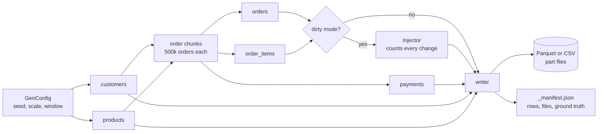
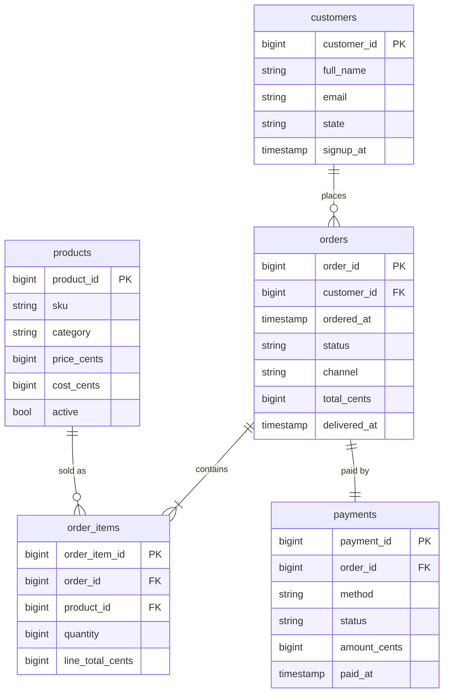
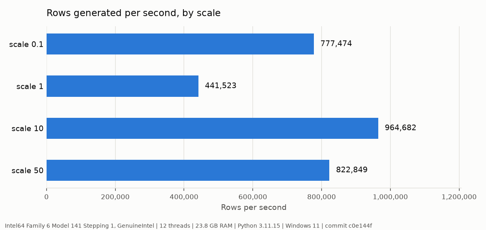
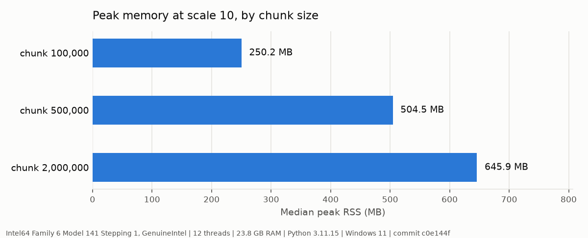
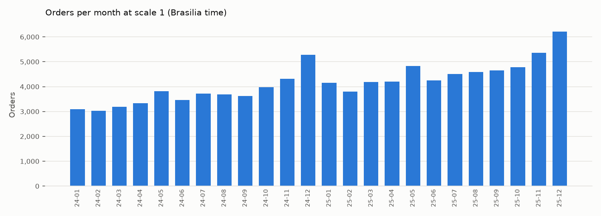

<p align="center">
  
</p>

<p align="center">
  <a href="https://github.com/silvano-moraes-de-souza/shopflow-datagen/actions/workflows/ci.yml"></a>
  
  
  <a href="https://github.com/silvano-moraes-de-souza/30-days-data-eng"></a>
</p>

> Deterministic synthetic e-commerce data, with a dirty mode that records exactly what it broke.

Every project in [30 Days of Data & Software Engineering](https://github.com/silvano-moraes-de-souza/30-days-data-eng) reads from this generator. The same seed gives the same customers, products, orders, items and payments on any machine, so a pipeline built on day 1 and a lakehouse built on day 4 are working on identical data.

## Problem

Portfolio data projects usually run on one of two things: a small Kaggle CSV that fits in memory and never changes, or random rows with no structure. Neither lets you test what a data platform is for. You can't measure incremental loads without a growing dataset, you can't benchmark a query plan on 5,000 rows, and you can't score a data quality tool if you don't know how many problems are actually in the data.

## Solution

A generator that produces a small Brazilian e-commerce store at any scale factor:

| Table | Rows at scale 1 | Notes |
|---|---:|---|
| customers | 20,000 | state weighted by population, signup dates spread over 4 years |
| products | 5,000 | 10 categories, log-normal prices ending in ,90, cost 45 to 75% of price |
| orders | 100,000 | demand curve with trend, weekday, Black Friday, December and Mother's Day |
| order_items | ~169,000 | 1 to 12 items per order, cheaper products sell more |
| payments | 100,000 | pix, card (with installments), boleto, debit; status follows order status |

With `--dirty`, it also injects nulls, duplicate rows, price outliers, orphan foreign keys and a schema change, and writes the exact count of each to `_manifest.json`. A quality check built later can then be scored: it found 175 of the 175 orphan rows, or it didn't.

## Architecture





## Quickstart

```bash
uv sync
uv run shopflow-datagen --scale 1 --out data/sf1
uv run shopflow-datagen --scale 1 --out data/sf1-dirty --dirty
uv run pytest
```

As a dependency in another project:

```bash
uv add "shopflow-datagen @ git+https://github.com/silvano-moraes-de-souza/shopflow-datagen"
```

```python
from pathlib import Path

from shopflow_datagen import DirtyConfig, GenConfig, generate_tables, write

# Files on disk, plus a manifest with row counts
manifest = write(GenConfig(scale=5, seed=42), out=Path("data/sf5"))

# In memory, for tests: PyArrow tables and the dirty-mode ground truth
tables, ground_truth = generate_tables(GenConfig(scale=0.1, dirty=DirtyConfig.default_dirty()))
```

Output of the dirty run above, as printed by the CLI:

```
customers          20,000 rows    1 files
products            5,000 rows    1 files
orders            100,505 rows    2 files
order_items       169,351 rows    1 files
payments          100,000 rows    1 files
total             394,856 rows  in 0.47s
  injected customers.email.null: 211
  injected orders.duplicate_rows: 505
  injected order_items.price_outlier: 160
  injected order_items.orphan_product_id: 175
  injected orders.schema_drift_rows: 20,101
  injected orders.channel.null: 788
  injected orders.sales_channel.null: 189
```

Null counts describe the files as written: duplicated rows carry their nulls, and in the drifted file the column is called `sales_channel`. An earlier version counted nulls before duplication and renaming (975), which [data-quality-engine](https://github.com/silvano-moraes-de-souza/data-quality-engine) caught when it found 788 in `channel`.

## Results

Measured with [`bench/run.py`](bench/run.py): 1 warmup and 3 timed runs per case, writing Parquet with zstd to local disk. Machine: Intel Tiger Lake-H laptop CPU (6 cores / 12 threads), 23.8 GB RAM, Windows 11, Python 3.11. Raw numbers are in [`results/throughput_by_scale.json`](results/throughput_by_scale.json) and [`results/memory_by_chunk_size.json`](results/memory_by_chunk_size.json).

| Scale | Rows written | Median time | Min / max | Rows per second | Peak RSS | Size on disk |
|---:|---:|---:|---:|---:|---:|---:|
| 0.1 | 40,867 | 0.05 s | 0.05 / 0.05 s | 777,474 | 96 MB | 0.7 MB |
| 1 | 394,351 | 0.89 s | 0.38 / 0.97 s | 441,523 | 173 MB | 6.4 MB |
| 10 | 3,915,163 | 4.06 s | 3.47 / 4.18 s | 964,682 | 496 MB | 51.5 MB |
| 50 | 19,531,906 | 23.74 s | 20.78 / 30.79 s | 822,849 | 575 MB | 261.8 MB |



From scale 10 to scale 50 the row count grows 5x and peak memory grows 16%, because orders are generated and written one chunk at a time. Scale 1 had a wide spread between runs (0.38 to 0.97 s) on a laptop that was also running other processes. The numbers are kept as measured.

Chunk size is the memory knob. At scale 10:

| Chunk size | Median time | Peak RSS | Size on disk |
|---:|---:|---:|---:|
| 100,000 | 4.13 s | 250 MB | 65.4 MB |
| 500,000 (default) | 4.16 s | 504 MB | 51.5 MB |
| 2,000,000 | 3.80 s | 646 MB | 49.9 MB |



Smaller chunks cut memory in half and take 27% more disk, because zstd compresses small Parquet files less well. Time barely moves.

### Does the data look like a store?

From [`bench/profile_data.py`](bench/profile_data.py) at scale 1, saved in [`results/data_profile.json`](results/data_profile.json):

| Metric | Value |
|---|---:|
| Average order value | R$ 360.23 |
| Median order value | R$ 172.70 |
| 95th percentile order value | R$ 1,144.42 |
| Items per order | 1.69 |
| Customers with at least one order | 70.4% |
| Share of orders from the top 1% of customers | 8.9% |
| Orders on Black Friday 2025 | 536 |
| Median orders per day, Nov 1 to 23, 2025 | 149 |
| March 2025 over March 2024 | 1.31x |
| Delivered / canceled / returned / in transit | 88.6% / 6.0% / 3.8% / 1.6% |



These shapes are hand tuned, not fitted to real market data. The goal is data plausible enough that a query, a dashboard or an anomaly detector behaves the way it would on a real store.

## How it works

Customers, products and orders are generated with NumPy arrays and PyArrow compute functions. There is no Python loop over rows.

Order timestamps come first. A day is drawn from a demand curve (linear growth from 1.0 to 1.6 over the window, a weekday curve, and multipliers for Black Friday weekend, Cyber Monday, December 1 to 20 and the week before Mother's Day), then an hour from a daily curve in Brasilia time, which is converted to UTC. The customer is drawn next, only among customers who had signed up by that moment. Customers are sorted by signup time, so the eligible ones are always a prefix of that order, and a `searchsorted` over the cumulative purchase propensity picks one in O(log n) without filtering.

Items are drawn per order from a product popularity distribution that favors cheaper products. Subtotals are summed with `np.bincount`, then discount and shipping are applied (free shipping from R$ 199, otherwise a flat fee by region). Payments inherit the order status: canceled orders are refused or refunded, returned orders are refunded, pending orders stay unpaid.

Each chunk of orders gets its own random stream from `SeedSequence([seed, table, chunk])`, so a chunk does not depend on how many random numbers the previous one consumed.

## Engineering decisions

| Decision | Alternatives | Reason |
|---|---|---|
| Money as integer cents (`bigint`) | `float`, `decimal` | Floats can't represent R$ 0.10 exactly, and sums drift. Decimal is exact but slow in NumPy and awkward across Parquet, Postgres and DuckDB. Integers are exact everywhere. |
| Timestamps stored in UTC, curves defined in Brasilia time | Local timestamps | Every downstream tool agrees on UTC. The generator converts once, so "evening peak" means evening in Brazil. |
| NumPy + PyArrow, no Faker | Faker, Mimesis | Faker generates row by row in Python, which is too slow for tens of millions of rows. Names and emails only need to be plausible, and small reference lists do that. |
| Chunked generation with per-chunk seeds | Generate everything at once | Memory stays close to flat as scale grows, and chunks could run in parallel later without changing results. |
| Sample the order time first, then an eligible customer | Sample the customer first, then a time after signup | The first version did the latter, and order volume grew 5x across two years instead of following the 1.6x trend: late signups crammed all their orders into the last months. `test_growth_follows_trend_not_signup_timing` keeps that from coming back. |
| Dirty mode counts every injection | Inject at a rate and report the rate | A rate says roughly how many problems exist. A count lets a quality tool be scored exactly. |
| Schema drift as a separate part file | Mixed schema inside one file | That is how drift shows up in practice: an upstream release changes the schema and new files arrive with the new shape next to the old ones. |

## Trade-offs and limitations

Output is deterministic for a given seed, scale, date window, chunk size and dirty config. Changing `chunk_size` changes the random streams, so the rows differ even with the same seed.

Generation is single-threaded. Chunks are independent, so a process pool would scale it, but at around 800k rows per second it has not been the bottleneck.

Customer popularity and signup date are independent. In a real store, older customers tend to have more orders.

The dirty mode covers nulls, duplicates, outliers, orphan keys and one schema change. It does not produce type errors (Parquet enforces types), late-arriving data or updates to existing rows. Updates are what day 3 (CDC) needs, so they will be added there.

There is no clickstream or event table yet. Day 17 (event-driven orders) will add one.

## Project structure

```
src/shopflow_datagen/
  config.py        GenConfig, DirtyConfig, table sizes by scale
  reference.py     states, names, categories, curves
  generate.py      vectorized table generators
  dirty.py         injectors with exact counts
  writer.py        Parquet/CSV part files and manifest
  cli.py           shopflow-datagen command
tests/             determinism, integrity, money invariants, ground truth
bench/             benchmark and data profile scripts
results/           raw benchmark JSON (committed)
docs/assets/       charts generated from results/
```

## Next steps

- Updates and deletes over time, for CDC (day 3)
- An order event stream, for the event-driven system (day 17)
- Labeled payment anomalies, for the anomaly detector (day 23)
- Parallel chunk generation

## Part of the series

This is day 00 of [30 Days of Data & Software Engineering](https://github.com/silvano-moraes-de-souza/30-days-data-eng). Next: day 01, E-commerce Data Pipeline.

## Author

Silvano Moraes de Souza · [GitHub](https://github.com/silvano-moraes-de-souza) · [Portfolio](https://silvanomsouza.vercel.app/)
